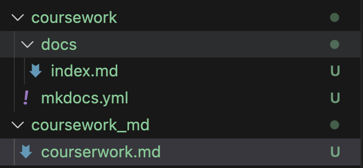
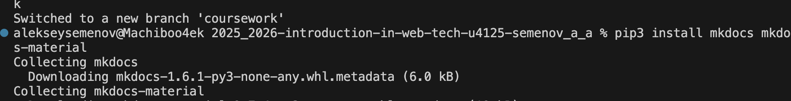
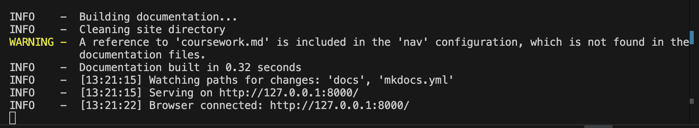
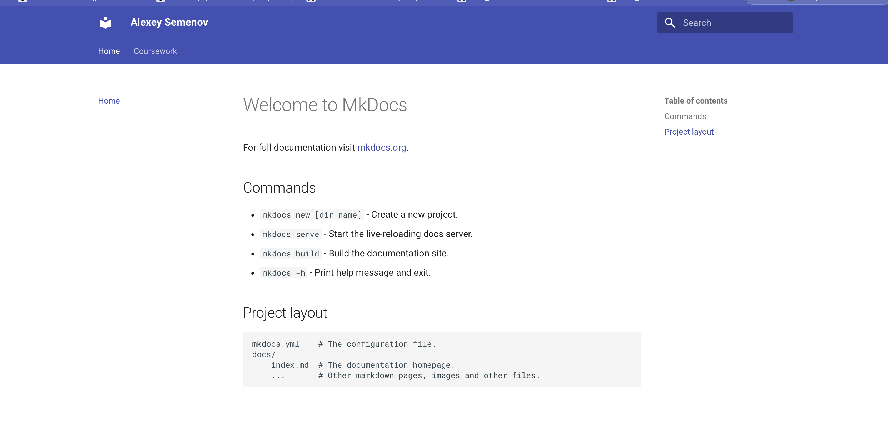
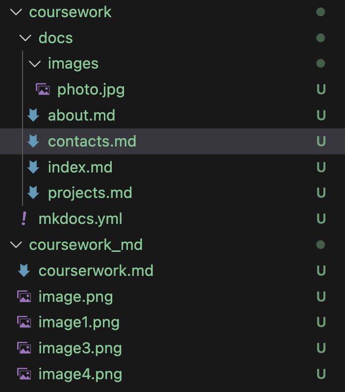
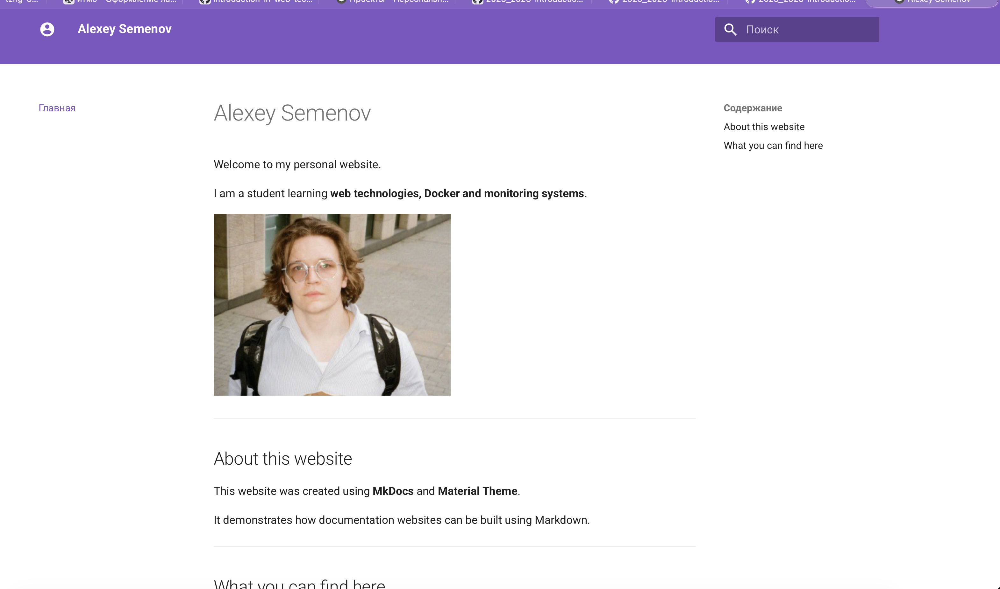
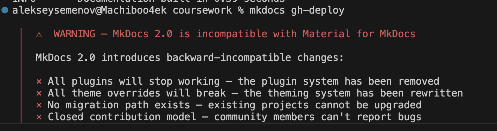
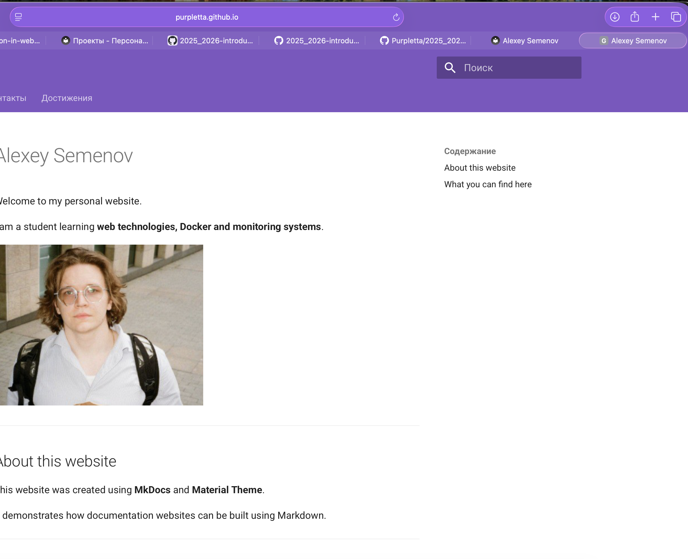

University: [ITMO University](https://itmo.ru/ru/)\
Faculty: [FICT](https://fict.itmo.ru)\
Course: [Введение в веб технологии](https://itmo-ict-faculty.github.io/introduction-in-web-tech/)\
Year: 2025/2026\
Group: u4125\
Author: Семенов Алексей Алексеевич\
Lab: coursework
Date of create: 10.03.2026\
Date of finished: 10.03.2026\

---

# Курсовая работа 
## Персональный сайт

---

## Ход работы

1) установил библиотеки и сделал папки

2) запустил сайт локально

3) Сделал несколько страниц, имею такую стуктуру, тестирую локально

4) Build'нул сайт, деплой, работает
ссылка: https://purpletta.github.io/2025_2026-introduction-in-web-tech-u4125-semenov_a_a/

