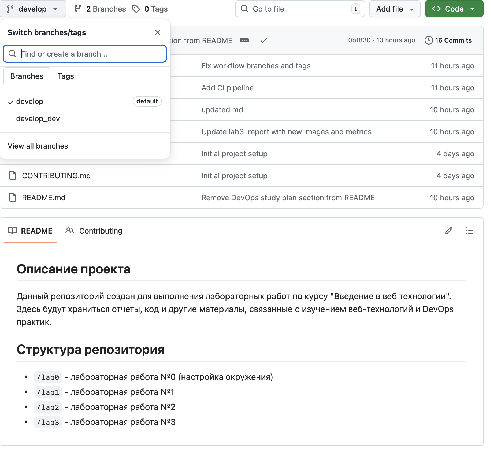

University: [ITMO University](https://itmo.ru/ru/)\
Faculty: [FICT](https://fict.itmo.ru)\
Course: [Введение в веб технологии](https://itmo-ict-faculty.github.io/introduction-in-web-tech/)\
Year: 2025/2026\
Group: u4125\
Author: Семенов Алексей Алексеевич\
Lab: Lab0\
Date of create: 02.03.2026\
Date of finished: 02.03.2026\

---

# Лабораторная работа №0

---

## Ход работы

1) Аккаунт на GitHub уже существовал, был сгенерирован новый SSH ключ для работы с репозиториями
2) Создала новый репозиторий: https://github.com/Purpletta/2025_2026-introduction-in-web-tech-u4125-semenov_a_a
3) С репозиторием работал через VS CODE, склонировал репозиторий с помощью команды git clone
4) Создал README.md, .gitignore файлы с описанием проекта
5) Далее создала новую ветку, в ней добавила новый файл CONTRIBUTING.md
6) Сделал коммит в данной ветке, чтобы потом слить изменения в develop ветку
7) Смержил pull request и удалила ветку develop

