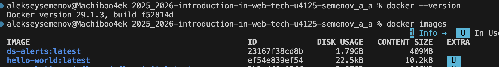
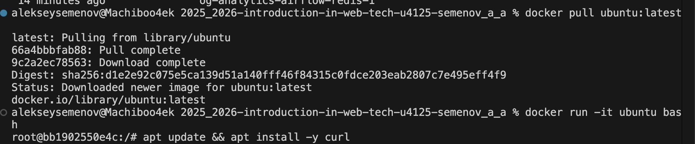
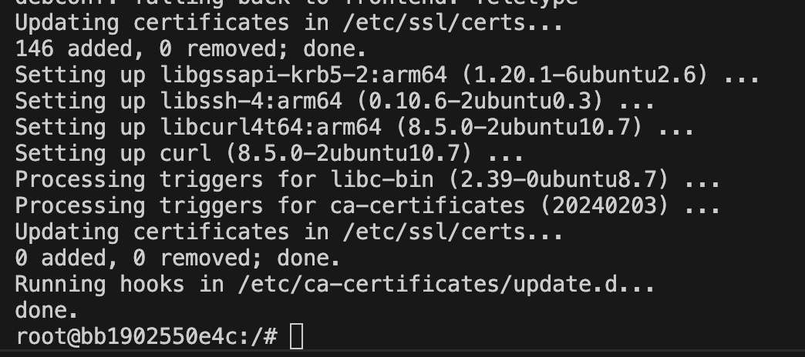
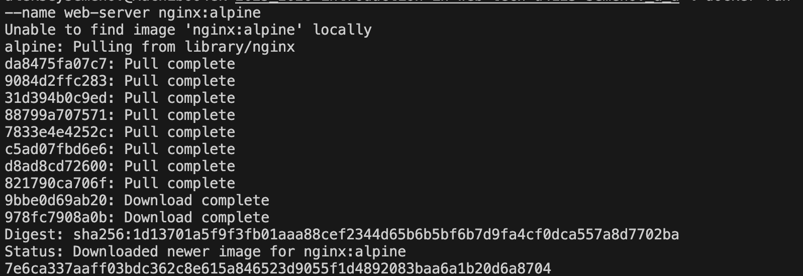
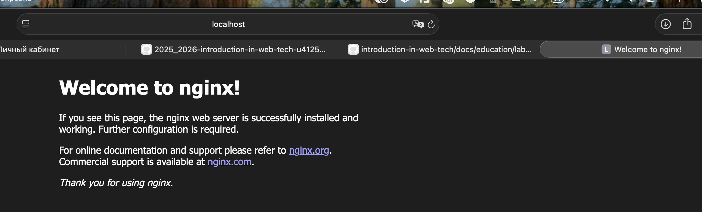
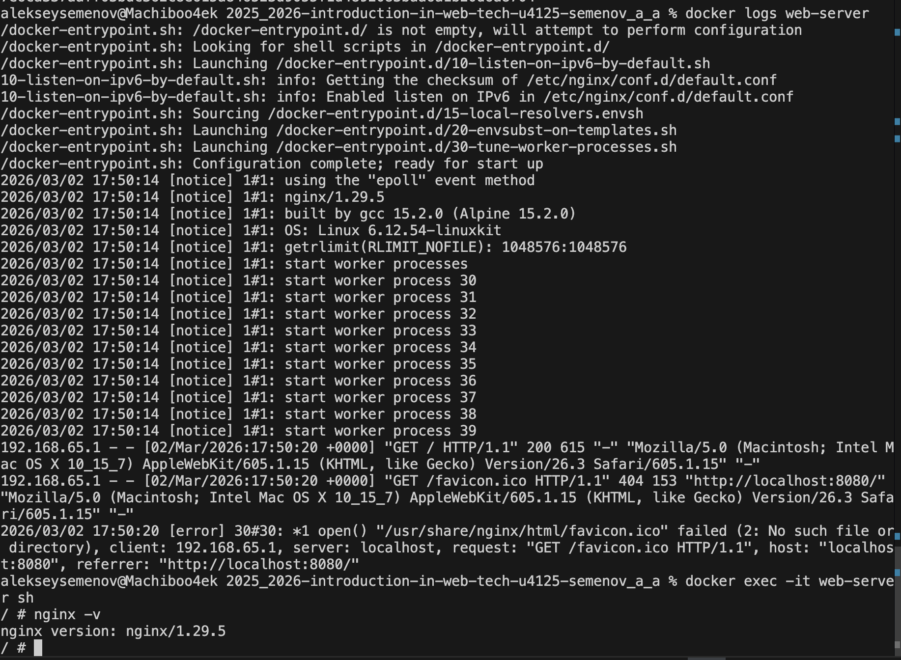
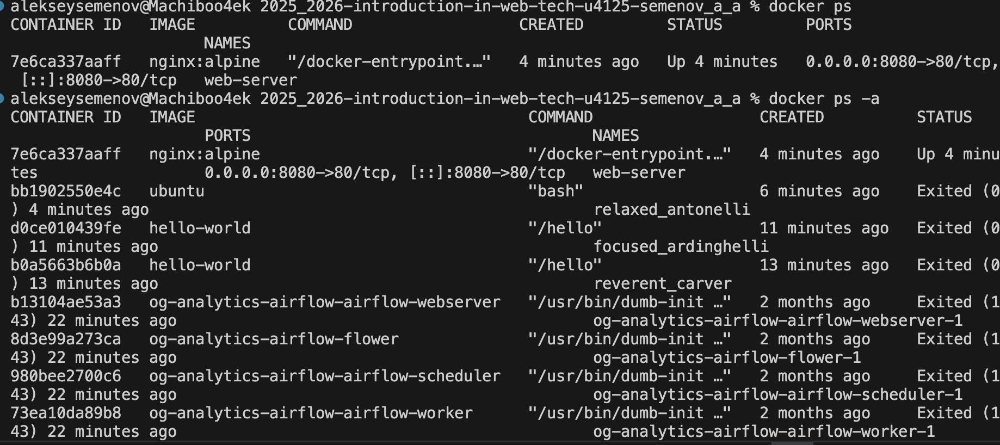
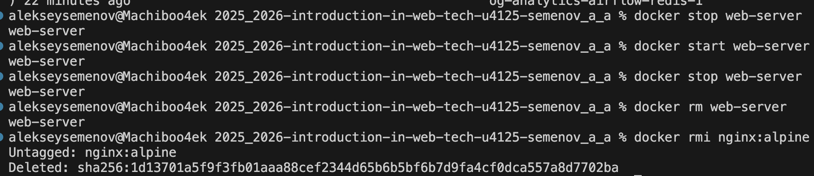
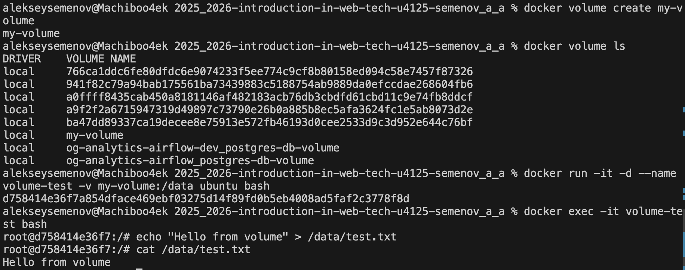
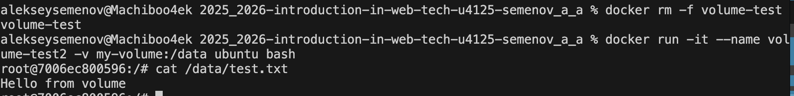

University: [ITMO University](https://itmo.ru/ru/)\
Faculty: [FICT](https://fict.itmo.ru)\
Course: [Введение в веб технологии](https://itmo-ict-faculty.github.io/introduction-in-web-tech/)\
Year: 2025/2026\
Group: u4125\
Author: Семенов Алексей Алексеевич\
Lab: Lab1\
Date of create: 02.03.2026\
Date of finished: 02.03.2026\

---

# Лабораторная работа №1  
## Основы работы с Docker

---

## Ход работы

1) Был установлен Docker Desktop.

2) Накатил убунту и curl 

3) Запустил контейнер с nginx (так как образа не было, он скачался). Работает на локальном хосте, все корректно

4) логи есть, подключился к контейнеру 

5) запустил остановил удалил контейнер иобраз

6) создал том, запустил контейнер с томом, подключился к контейнеру, создал файл в томе:

7) Удалил контейнер и создал новый с тем же томом. В контейнере запустил команду ls, далее cat для проверки содержимого файла:

