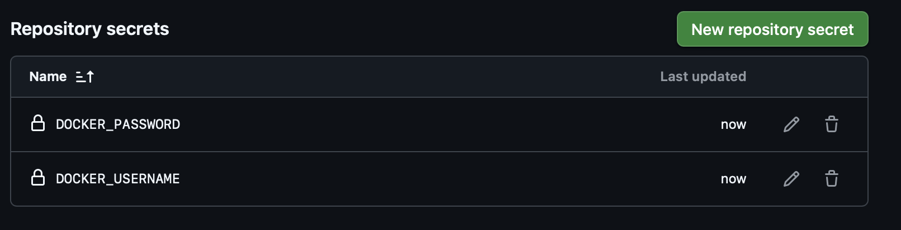
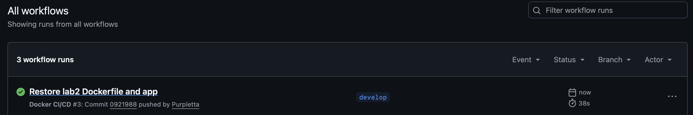

University: [ITMO University](https://itmo.ru/ru/)\
Faculty: [FICT](https://fict.itmo.ru)\
Course: [Введение в веб технологии](https://itmo-ict-faculty.github.io/introduction-in-web-tech/)\
Year: 2025/2026\
Group: u4125\
Author: Семенов Алексей Алексеевич\
Lab: Lab1\
Date of create: 02.03.2026\
Date of finished: 02.03.2026\
dd\
---

# Лабораторная работа №2  
## CI/CD для Docker приложения

---

## Ход работы

1) Был установлен Docker Desktop.

2) Накатил убунту и curl 

