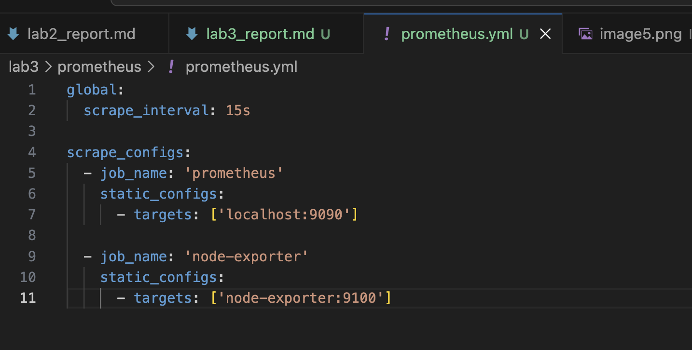
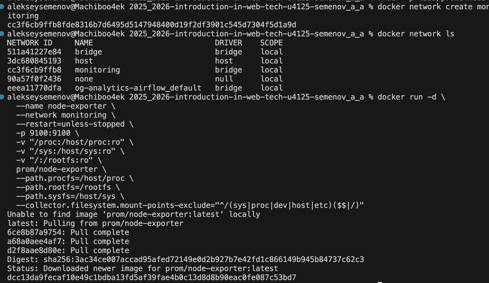
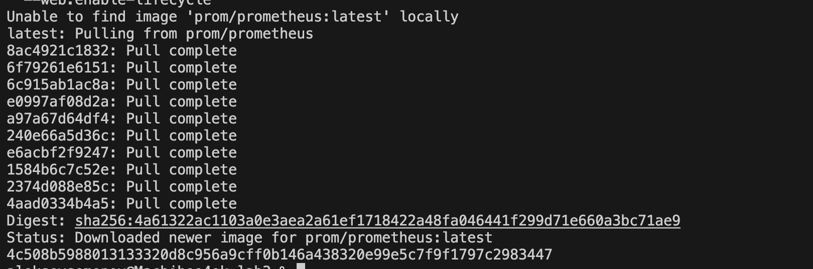
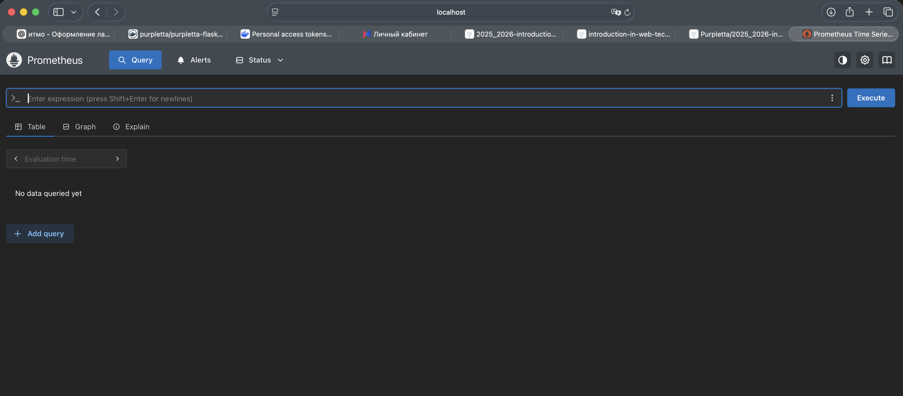
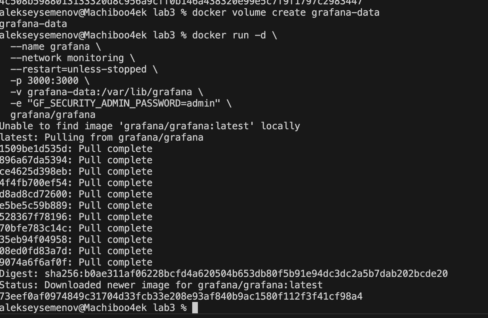
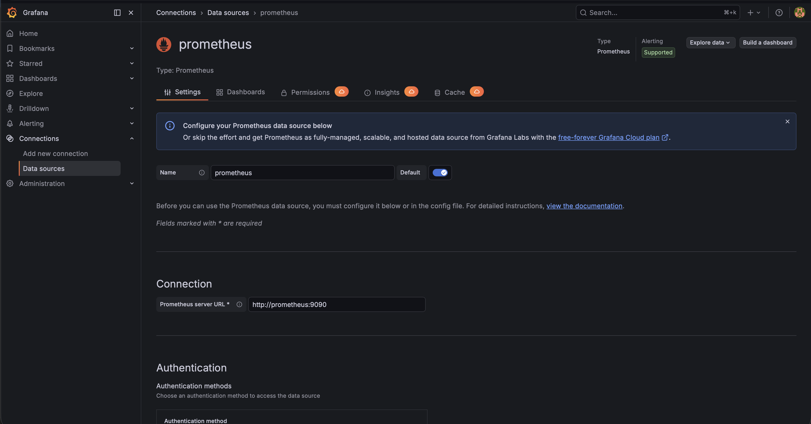
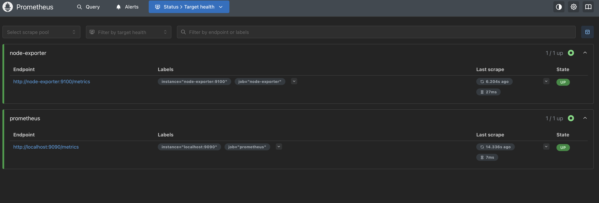

University: [ITMO University](https://itmo.ru/ru/)\
Faculty: [FICT](https://fict.itmo.ru)\
Course: [Введение в веб технологии](https://itmo-ict-faculty.github.io/introduction-in-web-tech/)\
Year: 2025/2026\
Group: u4125\
Author: Семенов Алексей Алексеевич\
Lab: Lab3\
Date of create: 02.03.2026\
Date of finished: 02.03.2026\

---

# Лабораторная работа №3 
## Мониторинг с Prometheus и Grafana

---

## Ход работы

1) сделал yml

2) запустил контейнер Node Exporter

3) Создал том prometheus-data, для работы с grafana создал общую сеть monitoring и скрин админки

4) зашел в админку графаны и подключил датасоурс прометея

